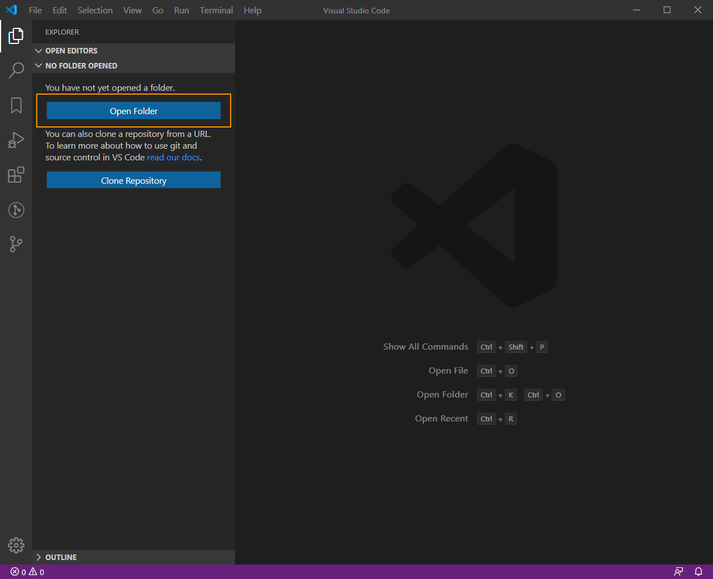
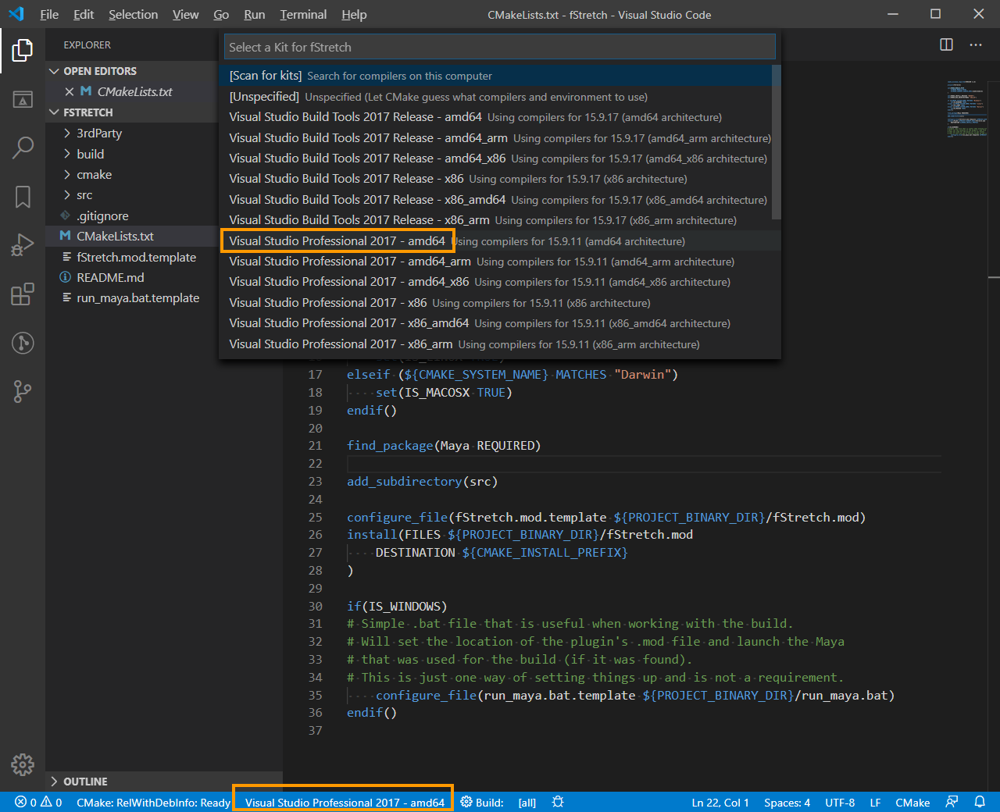
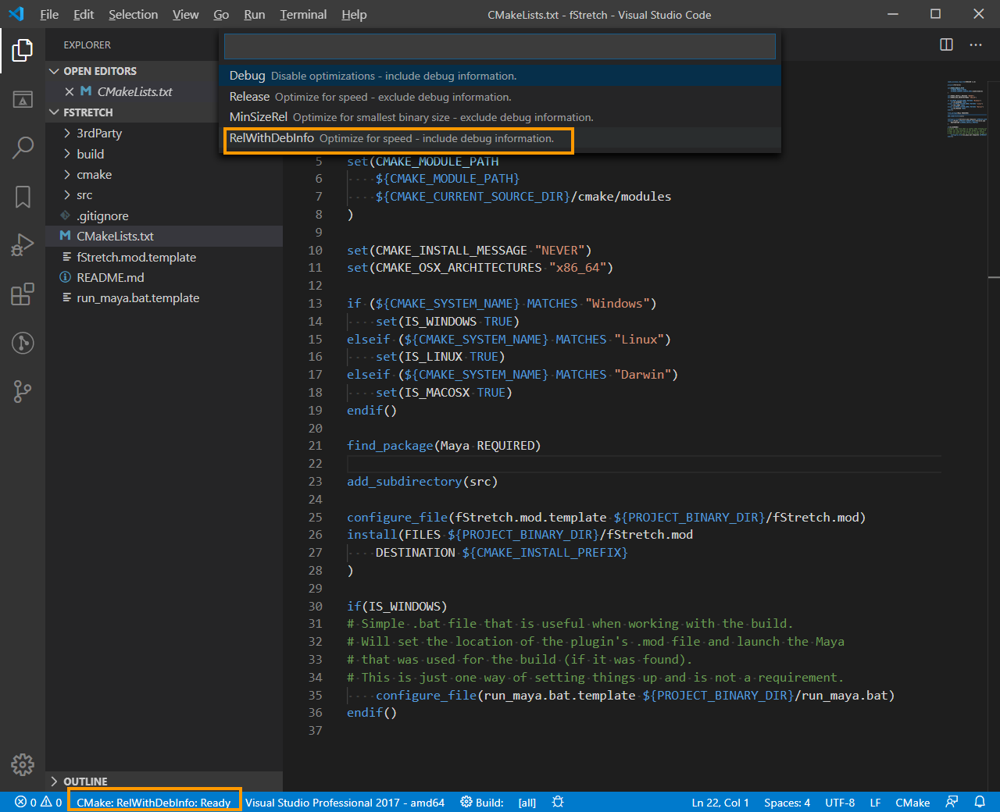
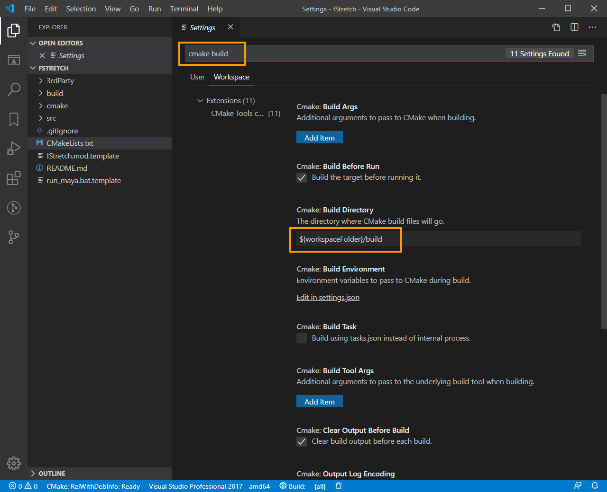
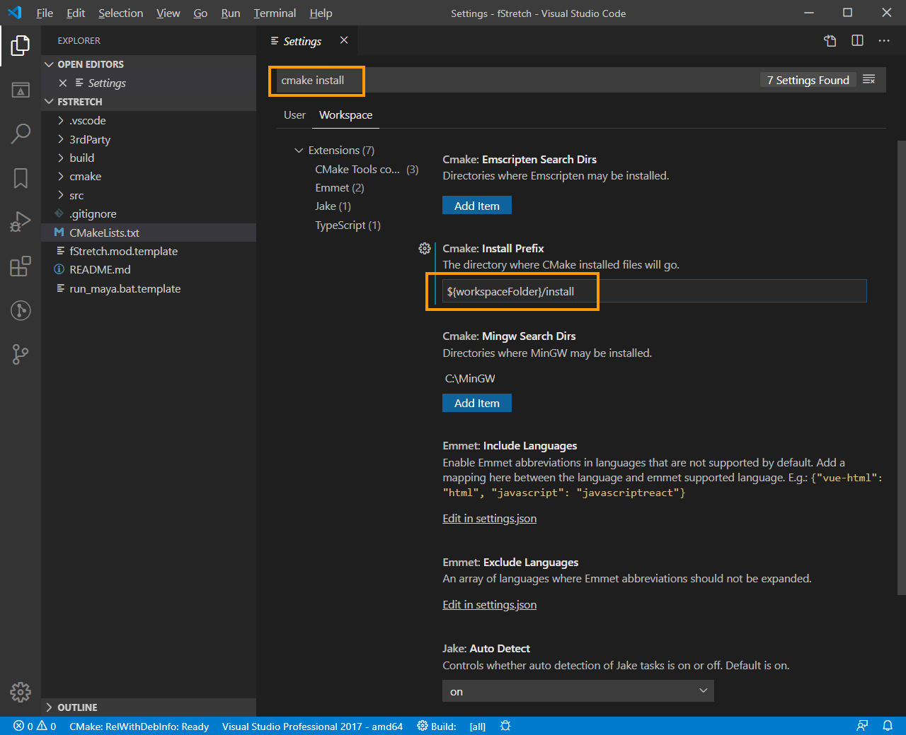
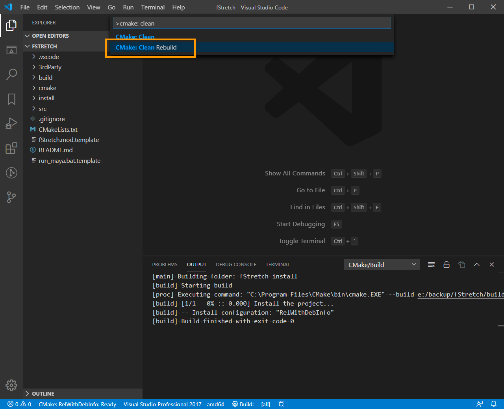
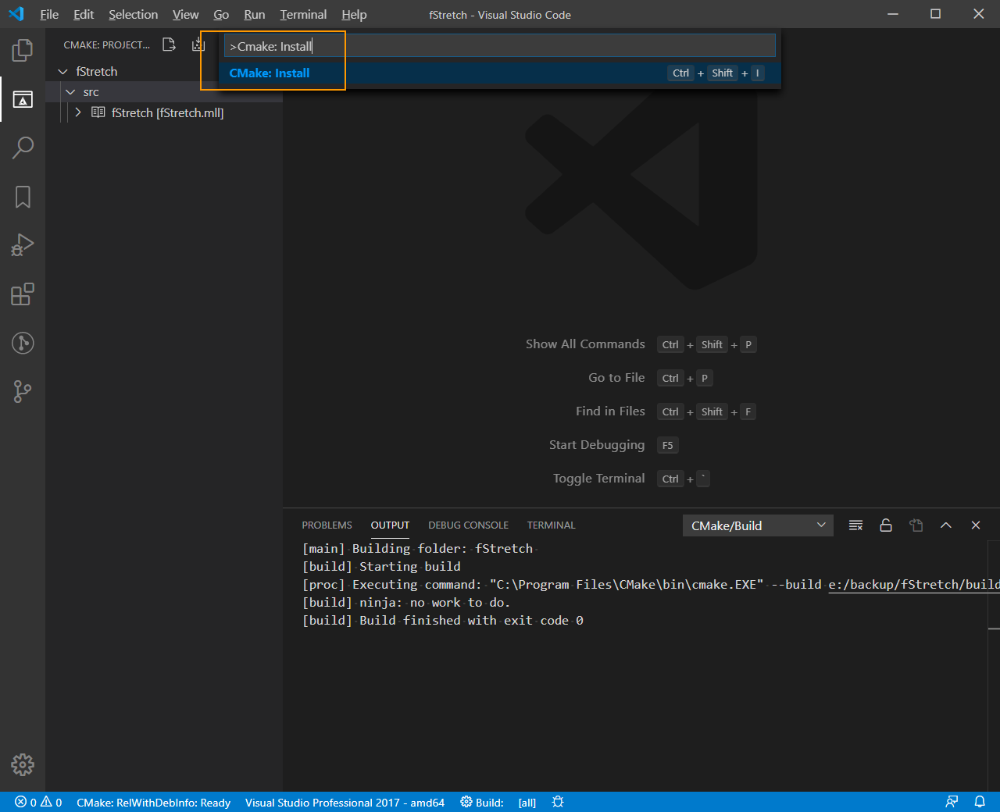
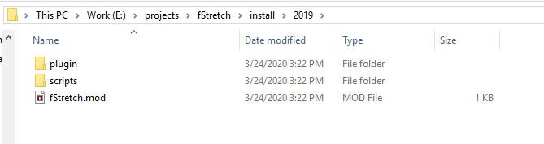

# Building
This will be updated over time, but here is how I currently build...

### Requirements
1. The source locally
2. Visual Studio Code
3. CMake Tools extension for VS Code
4. Visual Studio compilers

### Steps

